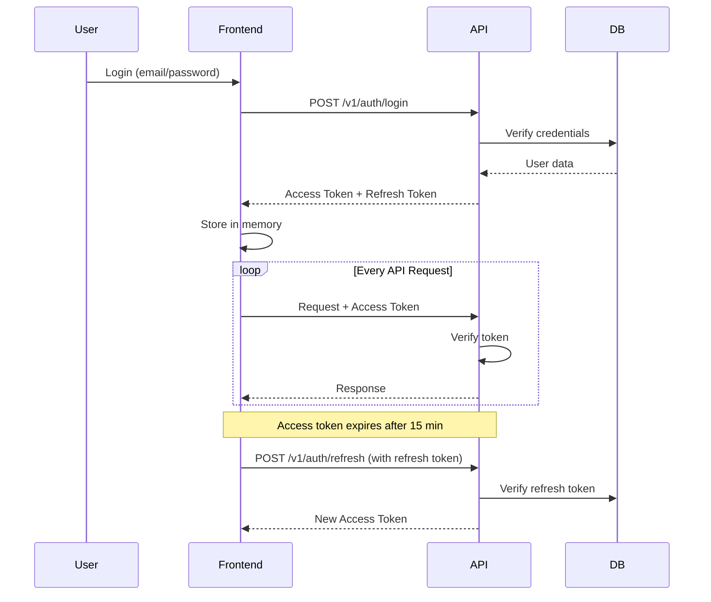

# Authentication Flow Documentation

## Overview
Story-Genius uses JWT-based authentication with access and refresh tokens for secure user sessions.

## Token Types

### Access Token
- **Purpose**: Authorize API requests
- **Lifetime**: 15 minutes
- **Storage**: Memory/Redux state (never localStorage)
- **Claims**: `user_id`, `email`, `exp`, `iat`

### Refresh Token
- **Purpose**: Obtain new access tokens
- **Lifetime**: 7 days
- **Storage**: HTTP-only secure cookie
- **Claims**: `user_id`, `token_id`, `exp`, `iat`

## Authentication Flow



## Token Refresh Flow

1. **Automatic Refresh**: Frontend detects expired access token (401)
2. **Refresh Request**: `POST /v1/auth/refresh` with refresh token
3. **Token Validation**: API verifies refresh token signature and expiry
4. **Issue New Access Token**: Returns fresh access token (15 min validity)
5. **Retry Original Request**: Frontend retries with new access token

## Token Revocation

### Logout
```http
POST /v1/auth/revoke
Authorization: Bearer <access_token>
```

- Adds refresh token to blacklist
- Clears frontend state
- All subsequent requests with that token fail

### Security Features

1. **Token Blacklist**: In-memory store (Redis in production)
2. **Automatic Cleanup**: Expired tokens removed hourly
3. **Forced Logout**: Admin can revoke tokens for specific users

## API Key Authentication

For service-to-service calls:
- **Format**: `X-API-Key: sk_live_xxxxx`
- **Rotation**: Every 90 days (old keys valid for 30-day grace period)
- **Scopes**: Limited permissions per key

## Security Best Practices

✅ **Do:**
- Store access tokens in memory only
- Use HTTP-only cookies for refresh tokens
- Implement automatic token refresh
- Clear tokens on logout
- Use HTTPS in production

❌ **Don't:**
- Store tokens in localStorage
- Include tokens in URLs
- Use wildcard CORS origins
- Hardcode secret keys

## Error Codes

| Code | Description |
|------|-------------|
| `AUTH_001` | Invalid credentials |
| `AUTH_002` | Access token expired |
| `AUTH_003` | Refresh token expired |
| `AUTH_004` | Token revoked |
| `AUTH_005` | Invalid token signature |
