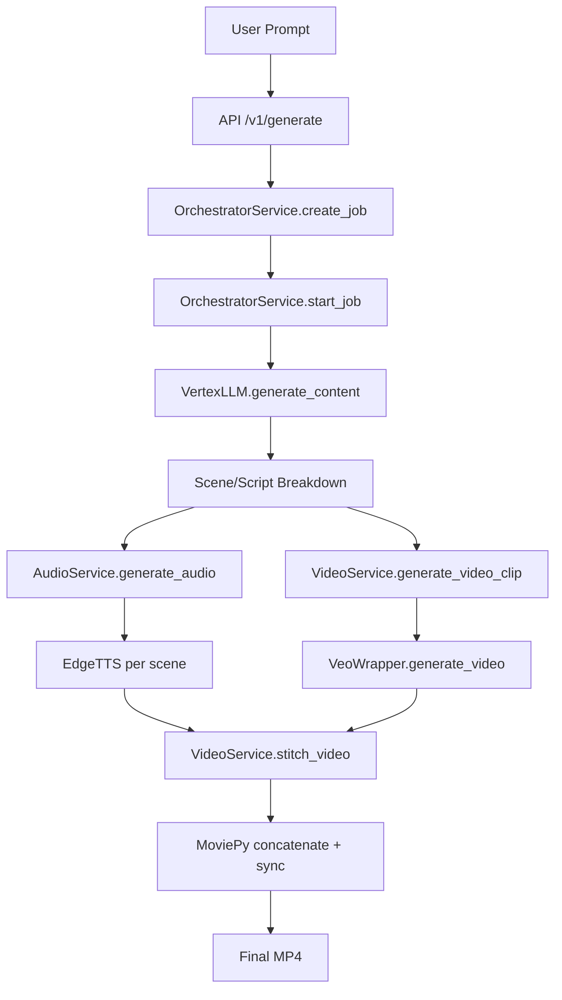

# Story-Genius Phase 1 Audit Report
## Days 1-7 Deliverable

---

## 1. Executive Summary

This audit documents the current Story-Genius codebase structure, identifies all 51 domains requiring migration, maps the video generation pipeline, and documents pain points that the refactor must address.

---

## 2. Current Architecture Overview

### Project Structure
```
yt-video-creator/
├── app/                     # Main application (51 domains)
│   ├── api/                 # FastAPI routes (30 files)
│   ├── orchestrator/        # Pipeline coordinator
│   ├── media/               # Audio + Video services
│   ├── engines/             # Pacing, text_overlay, thumbnail
│   ├── services/            # 31 utility services
│   └── ...                  # 45+ other domains
├── StoryGenius/             # Core AI wrappers
│   └── story_genius/
│       ├── llm/             # VertexLLM (Gemini)
│       ├── assets/          # VeoWrapper, ImagenWrapper
│       ├── audio/           # EdgeTTSVoiceModule
│       └── engines/         # Script, hook engines
├── frontend/                # Vite React app
└── infra/                   # Terraform, Docker configs
```

---

## 3. High-Level Flow: Prompt → Video



### Key Components

| Component | File | Responsibility |
|-----------|------|----------------|
| OrchestratorService | `app/orchestrator/service.py` | Coordinates entire pipeline, DB ops |
| VideoService | `app/media/video_service.py` | Veo calls, MoviePy stitching |
| AudioService | `app/media/audio_service.py` | EdgeTTS wrapper |
| VertexLLM | `StoryGenius/.../vertex_wrapper.py` | Gemini API calls |
| VeoWrapper | `StoryGenius/.../veo_wrapper.py` | Video generation API |
| ImagenWrapper | `StoryGenius/.../imagen_wrapper.py` | Reference image generation |

---

## 4. Domains to Migrate (51 Total)

### Tier 1: Core Business (Priority)
| Domain | Path | Migration Notes |
|--------|------|-----------------|
| `projects/` | `app/projects/` | CRUD + file storage |
| `orchestrator/` | `app/orchestrator/` | Refactor to use Celery |
| `media/` | `app/media/` | Keep, wrap in clients/ |
| `story/` | `app/story/` | Templates, script gen |
| `engines/` | `app/engines/` | Move to video_generation/utils |

### Tier 2: Supporting Domains
| Domain | Path | Migration Notes |
|--------|------|-----------------|
| `scheduling/` | `app/scheduling/` | Group with calendar, automation |
| `calendar/` | `app/calendar/` | → domains/scheduling/ |
| `automation/` | `app/automation/` | → domains/scheduling/ |
| `analytics/` | `app/analytics/` | Keep separate |
| `captions/` | `app/captions/` | → domains/content/ |
| `editor/` | `app/editor/` | → domains/content/ |
| `exports/` | `app/exports/` | → domains/content/ |
| `preview/` | `app/preview/` | → domains/content/ |

### Tier 3: Infrastructure
| Domain | Path | Migration Notes |
|--------|------|-----------------|
| `core/` | `app/core/` | Split: config → core/, DB → database/ |
| `api/` | `app/api/` | Migrate routes only |
| `auth/` | `app/auth/` | Keep old, migrate later |
| `observability/` | `app/observability/` | → core/logging, tracing |
| `reliability/` | `app/reliability/` | → clients/ retry logic |

### Tier 4: Deprioritized
| Domain | Notes |
|--------|-------|
| `billing/` | Skip for now |
| `collaboration/` | Skip for now |
| `compliance/`, `contracts/` | Skip for now |
| `experiments/`, `personal/`, `brand/` | Group into misc/ |

---

## 5. Pain Points Identified

### 5.1 Tight Coupling
```python
# Example: VideoService hard-codes StoryGenius path
STORYGENIUS_PATH = Path(__file__).parent.parent.parent / "StoryGenius"
sys.path.insert(0, str(STORYGENIUS_PATH))
from story_genius.assets.veo_wrapper import VeoWrapper
```
**Fix**: Use clients/ wrappers with dependency injection.

### 5.2 Synchronous AI Calls
```python
# OrchestratorService.start_job() blocks on all AI calls
veo.generate_video(full_prompt, output_path)  # Can take 60+ seconds
```
**Fix**: Celery tasks with async polling.

### 5.3 No Error Handling for Veo
```python
# VideoService - single try/except, no retry
try:
    veo.generate_video(full_prompt, output_path)
except Exception as e:
    logger.error(f"Video clip generation failed: {e}")
    raise  # No fallback!
```
**Fix**: Circuit breaker + cartoon/Ken Burns fallback.

### 5.4 Scattered Services
- 31 files in `app/services/` with no clear separation
- Mixed concerns: `ab_testing.py`, `gdpr_service.py`, `sso_service.py`
**Fix**: Domain-driven structure in `domains/`.

### 5.5 Missing Async Database
```python
# app/core/database.py uses sync SQLAlchemy
engine = create_engine(settings.DATABASE_URL)
Session = sessionmaker(autocommit=False, autoflush=False, bind=engine)
```
**Fix**: Use `asyncpg` + `sqlalchemy[asyncio]`.

---

## 6. Proposed Domain Boundaries

### New Structure
```
backend/src/
├── core/                    # Settings, logging, exceptions
├── database/                # Async SQLAlchemy, Alembic
├── clients/                 # External API wrappers
│   ├── vertex_client.py     # Gemini, Imagen 3, Veo 3
│   ├── elevenlabs_client.py # TTS (future, replace EdgeTTS)
│   └── storage_client.py    # Local/S3 media storage
├── domains/
│   ├── projects/            # entities, services, repos, routers
│   ├── stories/             # Script gen, templates
│   ├── video_generation/    # Veo orchestration, MoviePy utils
│   ├── scheduling/          # Calendar, automation, queues
│   ├── analytics/           # Usage tracking
│   └── content/             # Captions, editor, exports
├── tasks/                   # Celery tasks
│   ├── celery_app.py
│   └── video_gen_task.py
└── api/v1/                  # FastAPI routers
```

### video_generation/ Domain (Key)
```
domains/video_generation/
├── entities.py              # VideoJob, SceneClip
├── application/
│   └── services.py          # VideoGenerationService
├── infrastructure/
│   └── repositories.py      # DB ops for jobs
├── presentation/
│   └── routers.py           # POST /v1/projects/{id}/generate-video
└── utils/
    ├── pacing.py            # From app/engines/pacing/
    ├── text_overlay.py      # From app/engines/text_overlay/
    └── thumbnail.py         # From app/engines/thumbnail/
```

---

## 7. Migration Path

### Strategy: Parallel Coexistence
1. Keep `app/` running for current features
2. Build new `backend/src/` alongside it
3. Use feature flags to route requests
4. Migrate domain by domain
5. Deprecate old code after validation

### Phase 1 Focus (Days 8-14)
- Create new branch `refactor-core-2026`
- Init Poetry project with deps
- Build skeleton: core/, database/, minimal API
- Dockerize with postgres + redis

---

## 8. Current Dependencies

```
# requirements.txt
fastapi>=0.104.0
uvicorn>=0.24.0
pydantic>=2.0.0
sqlalchemy>=2.0.0
psycopg2-binary>=2.9.0
moviepy>=2.0.0
edge-tts>=6.1.0
google-cloud-aiplatform>=1.38.0
Pillow>=10.0.0
```

### Missing for New Architecture
- `alembic` - Migrations
- `celery[redis]` - Async tasks
- `asyncpg` - Async Postgres
- `elevenlabs` - Better TTS (future)
- `ffmpeg-python` - Video processing
- `pytest-asyncio` - Testing
- `ruff` - Linting

---

## 9. Next Steps (Days 8-14)

1. **Day 8-10**: Setup new branch & tooling
   - Poetry project
   - docker-compose.yml
   - Pre-commit hooks

2. **Day 11-14**: Build skeleton
   - core/settings.py
   - database/ with async engine
   - main.py with /health endpoint
   - Alembic init

---

*Audit completed: 2026-01-29*
